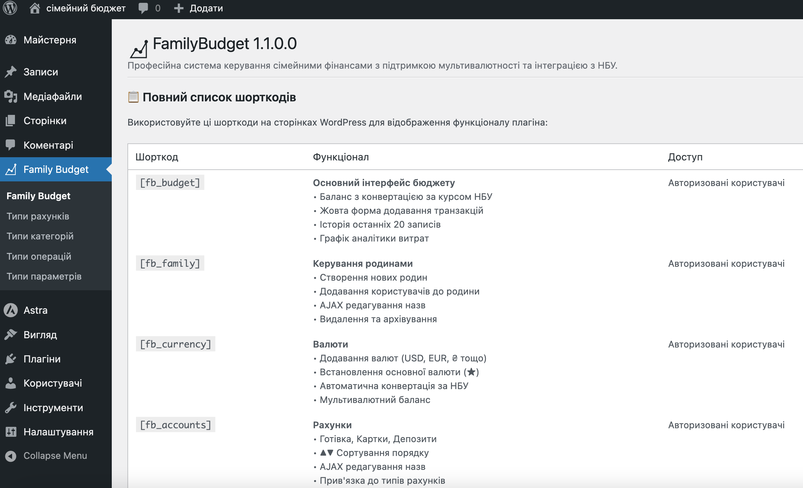
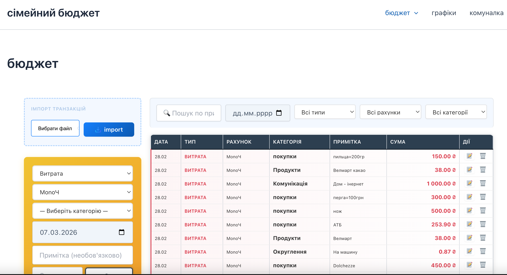
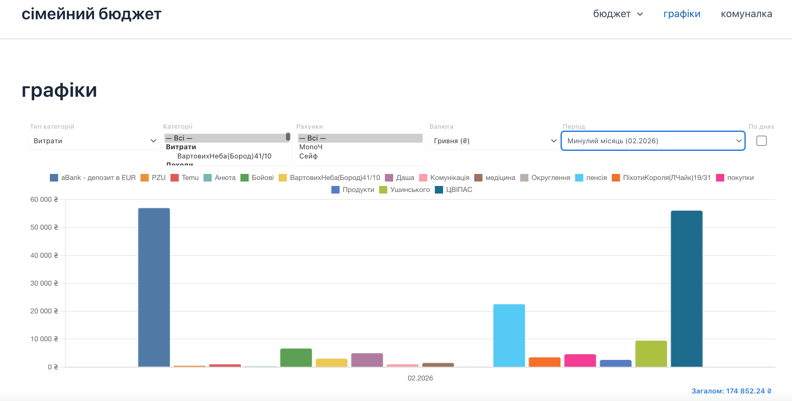

# 💰 Family Budget — WordPress Plugin

> Кастомний плагін для обліку та управління сімейним бюджетом з підтримкою кількох родин, категорій, транзакцій та аналітики.

[](https://wordpress.org)
[](https://php.net)
[](https://www.gnu.org/licenses/gpl-2.0.html)
[](https://developer.wordpress.org/coding-standards/)

---

## 📋 Зміст

- [Про плагін](#про-плагін)
- [Можливості](#можливості)
- [Вимоги](#вимоги)
- [Встановлення](#встановлення)
- [Структура плагіна](#структура-плагіна)
- [Архітектура та безпека](#архітектура-та-безпека)
- [Стандарти розробки](#стандарти-розробки)
- [Скріншоти](#скріншоти)
- [Частові запитання](#частові-запитання)
- [Changelog](#changelog)
- [Ліцензія](#ліцензія)

---

## Про плагін

**Family Budget** — це потужний WordPress-плагін для ведення обліку сімейного бюджету. 
Плагін дозволяє декільком родинам (Family) незалежно один від одного вести облік доходів і витрат, 
аналізувати фінансову активність за категоріями та часовими проміжками, а також керувати рахунками та бюджетами.

Плагін розроблений із суворим дотриманням **WordPress Coding Standards (WPCS)**, із акцентом на безпеку, 
ізоляцію даних між користувачами та оптимальну продуктивність.

---

## Можливості

### 👨‍👩‍👧‍👦 Управління родинами
- Створення та редагування кількох незалежних "Родин"
- Прив'язка користувачів WordPress до конкретних родин
- Повна ізоляція даних між родинами

### 💳 Рахунки та гаманці
- Необмежена кількість рахунків на родину (готівка, карта, накопичення тощо)
- Відстеження поточних балансів
- Переказ коштів між рахунками

### 📊 Транзакції
- Облік доходів та витрат
- Категоризація транзакцій
- Фільтрація за датою, категорією, рахунком та типом
- Пошук по транзакціях

### 🏷️ Категорії
- Ієрархічні категорії витрат та доходів
- Кольорове маркування категорій
- Іконки для категорій

### 📈 Аналітика та звіти
- Підсумки за місяць/квартал/рік
- Розбивка витрат за категоріями
- Динаміка доходів і витрат у вигляді графіків

### 🔐 Безпека
- Двошарова перевірка доступу (ролі + nonce)
- Повна ізоляція даних між родинами
- Захист від CSRF-атак

---

## Вимоги

| Залежність   | Мінімальна версія |
|--------------|-------------------|
| WordPress    | 6.0               |
| PHP          | 8.0               |
| MySQL/MariaDB| 5.7 / 10.3        |

---

## Встановлення

### Варіант 1: Ручне встановлення

1. Завантажте архів плагіна (`.zip`) зі сторінки [Releases](../../releases).
2. У адмін-панелі WordPress перейдіть до **Плагіни → Додати новий → Завантажити плагін**.
3. Виберіть завантажений `.zip`-файл та натисніть **Встановити зараз**.
4. Активуйте плагін.

### Варіант 2: Через Git (для розробників)

```bash
# Перейдіть у директорію плагінів WordPress
cd /wp-content/plugins/

# Клонуйте репозиторій
git clone https://github.com/your-username/family-budget.git family-budget

# Активуйте плагін через WP-CLI (опційно)
wp plugin activate family-budget
```

### Після встановлення

Після активації плагін автоматично:
- Створює необхідні таблиці в базі даних
- Додає пункт **Family Budget** у меню адмін-панелі
- Реєструє необхідні ролі та можливості користувачів

---

## Структура плагіна

```
family-budget/
│
├── family-budget.php            # Головний файл плагіна (bootstrap, реєстрація хуків)
├── db-setup.php                 # Створення та міграція таблиць БД при активації
├── fb_function.php              # Глобальні допоміжні функції (fb_*)
├── README.md
│
├── css/                         # Стилі адмін-інтерфейсу
├── js/                          # JavaScript (AJAX, UI-логіка)
├── img/                         # Зображення та іконки плагіна
│
│── Класи (class-*.php)
│   ├── class-fb-crud.php        # Базовий CRUD-клас для роботи з БД
│   ├── class-fb-import.php      # Імпорт даних (CSV тощо)
│   └── class-fb-currency-rates.php # Отримання та кешування курсів валют
│
└── Сторінки / модулі (views)
    ├── home.php                 # Головна панель (дашборд)
    ├── family.php               # Управління родинами
    ├── account.php              # Рахунки та гаманці
    ├── account-type.php         # Типи рахунків
    ├── amount.php               # Транзакції (доходи/витрати)
    ├── amount-type.php          # Типи транзакцій
    ├── category.php             # Категорії
    ├── category-type.php        # Типи категорій
    ├── category-params.php      # Параметри категорій
    ├── parameter-type.php       # Типи параметрів
    ├── currency.php             # Управління валютами
    ├── communal.php             # Комунальні платежі
    └── fb-charts.php            # Графіки та аналітика
```

---

## Архітектура та безпека

### Двошарова перевірка доступу

Для всіх чутливих операцій використовується функція `fb_accounts_verify_request()`, яка виконує:
1. Перевірку ролі/можливостей (`current_user_can()`)
2. Перевірку nonce-токена для захисту від CSRF

```php
// Приклад використання
if ( ! fb_accounts_verify_request( 'fb_manage_accounts', 'fb_accounts_nonce' ) ) {
    wp_die( esc_html__( 'Доступ заборонено.', 'family-budget' ) );
}
```

### Ізоляція даних між родинами

Перед будь-якою операцією з БД перевіряється належність ресурсу до родини поточного користувача:

```php
// Перевірка доступу до родини перед вибіркою
$family_id = absint( $_GET['family_id'] );
if ( ! fb_user_has_family_access( get_current_user_id(), $family_id ) ) {
    wp_send_json_error( [ 'message' => __( 'Доступ заборонено.', 'family-budget' ) ] );
}
```

### Безпечні SQL-запити

Всі запити до БД виключно через `$wpdb->prepare()`:

```php
$results = $wpdb->get_results(
    $wpdb->prepare(
        "SELECT * FROM {$wpdb->prefix}fb_transactions
         WHERE family_id = %d AND user_id = %d
         ORDER BY transaction_date DESC",
        $family_id,
        get_current_user_id()
    )
);
```

### Санітизація та екранування

```php
// Вхідні дані — sanitize при отриманні
$title = sanitize_text_field( wp_unslash( $_POST['title'] ?? '' ) );
$amount = (float) wp_unslash( $_POST['amount'] ?? 0 );
$id     = absint( $_GET['id'] ?? 0 );

// Вивід — escape безпосередньо при виводі
echo esc_html( $title );
echo esc_attr( $amount );
echo esc_url( $url );
```

---

## Стандарти розробки

### Неймінг

| Тип              | Конвенція              | Приклад                          |
|------------------|------------------------|----------------------------------|
| Функції          | `fb_` префікс          | `fb_get_families()`              |
| Класи            | `FB_` префікс          | `class FB_Database_Helper`       |
| Константи        | `FB_` префікс (CAPS)   | `define( 'FB_VERSION', '1.0.0' )`|
| Таблиці БД       | `{prefix}fb_` префікс  | `wp_fb_transactions`             |
| Хуки             | `fb_` префікс          | `do_action( 'fb_after_save' )`   |

### PHPDoc — обов'язковий для всіх функцій

```php
/**
 * Отримує список рахунків для вказаної родини.
 *
 * Перевіряє доступ поточного користувача до родини перед вибіркою.
 * Повертає порожній масив, якщо доступ відсутній або дані не знайдено.
 *
 * @param int $family_id Ідентифікатор родини.
 * @param bool $active_only Якщо true — повертає лише активні рахунки.
 *
 * @return array Масив об'єктів рахунків або порожній масив.
 */
function fb_get_accounts( int $family_id, bool $active_only = true ): array {
    // ...
}
```

### Структура модуля (порядок у файлі)

```
1. Ініціалізація та перевірки доступу
2. Бізнес-логіка (отримання та обробка даних)
3. HTML-рендеринг (шаблон/view)
4. JavaScript (підключається через wp_footer / admin_footer)
```

### Inline-скрипти — тільки через footer-хук

```php
// ✅ Правильно
add_action( 'admin_footer', 'fb_accounts_inline_script' );

function fb_accounts_inline_script(): void {
    $data = [ 'nonce' => wp_create_nonce( 'fb_accounts_nonce' ) ];
    echo '<script>const fbAccounts = ' . wp_json_encode( $data ) . ';</script>';
}

// ❌ Неправильно — не використовувати wp_head або inline у шаблоні
```

---

## Скріншоти

> *(Додайте скріншоти до папки `.github/screenshots/` та оновіть посилання нижче)*

| Панель управління | Транзакції | Аналітика |
|:-----------------:|:----------:|:---------:|
|  |  |  |

---

## Частові запитання

**Чи можна мати кілька родин для одного WordPress-сайту?**
Так. Плагін підтримує необмежену кількість незалежних родин з повною ізоляцією даних.

**Як додати нового учасника до родини?**
Перейдіть до **Family Budget → Родини**, виберіть потрібну родину та натисніть "Учасники". Там можна прив'язати будь-якого зареєстрованого користувача WordPress.

**Чи видаляються дані після деактивації плагіна?**
Ні. Деактивація не видаляє дані. Для повного видалення даних скористайтесь **Плагіни → Видалити**. Дані буде очищено автоматично через `uninstall.php`.

**Чи підтримується мультисайт (WordPress Multisite)?**
На поточному етапі підтримка Multisite не гарантована. Планується у майбутніх версіях.

---

## Changelog

### [1.0.0] — 2025-01-01
- 🎉 Перший реліз плагіна
- Управління родинами, рахунками та категоріями
- Облік транзакцій (доходи/витрати)
- Базова аналітика та фільтрація
- Двошарова система безпеки (ролі + nonce)
- AJAX-операції з захистом від CSRF
- Повна ізоляція даних між родинами

---

## Участь у розробці

Внески вітаються! Будь ласка, ознайомтесь із правилами:

1. Форкніть репозиторій
2. Створіть гілку для вашої функції: `git checkout -b feature/назва-функції`
3. Переконайтесь, що код відповідає **WPCS** (WordPress Coding Standards)
4. Усі коментарі та PHPDoc — українською мовою
5. Надішліть Pull Request із детальним описом змін

### Налаштування середовища розробки

```bash
# Клонування
git clone https://github.com/AleksandrDikiy/family-budget.git

# Встановлення залежностей (якщо використовується Composer)
composer install

# Перевірка стандартів коду
./vendor/bin/phpcs --standard=WordPress .

# Автоматичне виправлення стилю
./vendor/bin/phpcbf --standard=WordPress .
```

---

## Ліцензія

Цей плагін розповсюджується під ліцензією [GNU General Public License v2.0 або пізнішою](https://www.gnu.org/licenses/gpl-2.0.html), що відповідає екосистемі WordPress.

---

<p align="center">
  Розроблено з ❤️ для WordPress-спільноти
</p>
